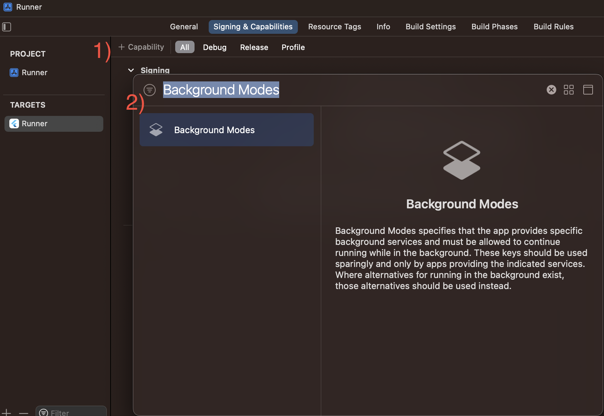
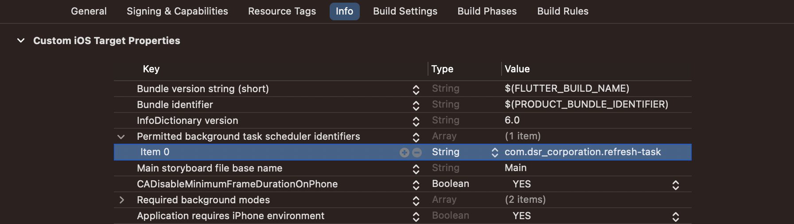

# flutter_background_executor

This plugin is created for background tasks. It
supports [scheduled refresh task](#scheduled-refresh-task)
and [immediate background task](#immediate-task). The refresh task logic is based on
[WorkManager](https://developer.android.com/topic/libraries/architecture/workmanager) for Android
and [BackgroundTasks](https://developer.apple.com/documentation/backgroundtasks) for iOS.

## Requirements

Requires Dart SDK >=2.17.0 <3.0.0

Requires Flutter SDK >=3.0.0

## Platforms

### Android

Requires Android SDK 21+

### iOS

Immediate background task requires iOS 11+

Scheduled refresh task requires iOS 13+

## How it works

To run background tasks, this library creates
new [Flutter Engine](https://api.flutter.dev/javadoc/io/flutter/embedding/engine/FlutterEngine.html)
. This allows you to run tasks when the application is in the background. In fact, the background
task and the main application are different applications that cannot communicate using basic Flutter
tools. But this is possible if you use the native part of the application and this
is [implemented in this library](#communication-between-tasks).

> **Warning**: Some libraries may not be ready for this use. But in most cases, you can find a workaround with [task management](#task-management).

## Scheduled refresh task

### Flutter

To schedule a refresh task, call the `createRefreshTask` function.

```dart
class Example {
  Future<void> settingRefresh() async {
    await FlutterBackgroundExecutor().createRefreshTask(
      callback: refresh,
      settings: RefreshTaskSettings(
        androidDetails: AndroidRefreshTaskDetails(),
        iosDetails: IosRefreshTaskDetails(taskIdentifier: 'com.dsr_corporation.refresh-task'),
      ),
    );
  }
}
```

In this case, a static function is passed to the callback parameter

```dart
class Example {
  Future<void> settingRefresh() async {
    await FlutterBackgroundExecutor().createRefreshTask(
      callback: refresh,
      settings: RefreshTaskSettings(
        androidDetails: AndroidRefreshTaskDetails(),
        iosDetails: IosRefreshTaskDetails(taskIdentifier: 'com.dsr_corporation.refresh-task'),
      ),
    );
  }
}

@pragma('vm:entry-point')
Future<void> refresh() async {
  print('Called refresh task');
}
```

or

```dart
class Example {
  Future<void> settingRefresh() async {
    await FlutterBackgroundExecutor().createRefreshTask(
      callback: refresh,
      settings: RefreshTaskSettings(
        androidDetails: AndroidRefreshTaskDetails(),
        iosDetails: IosRefreshTaskDetails(taskIdentifier: 'com.dsr_corporation.refresh-task'),
      ),
    );
  }

  @pragma('vm:entry-point')
  static Future<void> refresh() async {
    print('Called refresh task');
  }
}
```

> **Warning**: If you are using Flutter 3.3.0 or newer, you must annotate the refresh task function with `@pragma('vm:entry-point')`.

> **Note**: You can schedule only one refresh task.

### Android

To set up a scheduled refresh task on Android, you can change the following options:

| Option                | Type               | Description                                                                                  | Default value                  |
|:----------------------|--------------------|----------------------------------------------------------------------------------------------|--------------------------------|
| requiredNetworkType   | AndroidNetworkType | The type of network required for the work to run.                                            | AndroidNetworkType.notRequired |
| requiresCharging      | bool               | Whether device should be charging for the work to run.                                       | false                          |
| requiresDeviceIdle    | bool               | Whether device should be idle for the work to run(Android SDK 23+)                           | false                          |
| requiresBatteryNotLow | bool               | Whether the device's battery level must be acceptable for the work to run.                   | false                          |
| requiresStorageNotLow | bool               | Whether the device's available storage should be at an acceptable level for the work to run. | false                          |
| minUpdateDelay        | Duration           | Sets the delay that is allowed from the time a content.                                      | Duration(minutes: 15)          |
| maxUpdateDelay        | Duration           | Sets the maximum delay that is allowed from the first time a content.                        | Duration(hours: 1)             |
| initialDelay          | Duration           | Sets an initial delay for the work.                                                          | Duration(minutes: 3)           |
| repeatInterval        | Duration           | The repeat interval.                                                                         | Duration(minutes: 15)          |
| flexInterval          | Duration           | The duration for which this work repeats from the end of the repeatInterval.                 | Duration(minutes: 15)          |

### iOS

To set up a background task on iOS, you need to do the following:

1. Need to add capability `Background Modes` 
2. Need to select `Background fetch` and `Background processing` 
3. Need to set background task identifier in Info.plist
   on `Permitted background task scheduler identifiers`(`BGTaskSchedulerPermittedIdentifiers`) 

The required steps for configuring background work are now complete. But in this case, the task will
be configured only on the second run. This is due to the fact that iOS allows you to configure
background tasks only during the launch of the application itself. In order to set up a task for the
first run, you need to pass the task identifier to the plugin:

```swift
@UIApplicationMain
@objc class AppDelegate: FlutterAppDelegate {
    override func application(
        _ application: UIApplication,
        didFinishLaunchingWithOptions launchOptions: [UIApplication.LaunchOptionsKey: Any]?
    ) -> Bool {
        SwiftFlutterBackgroundExecutorPlugin.taskIdentifier = "com.dsr-corporation.refresh-task"
        ...
        return super.application(application, didFinishLaunchingWithOptions: launchOptions);
    }
}

```

or

```swift
@UIApplicationMain
@objc class AppDelegate: FlutterAppDelegate {
    override func application(
        _ application: UIApplication,
        didFinishLaunchingWithOptions launchOptions: [UIApplication.LaunchOptionsKey: Any]?
    ) -> Bool {
        UserDefaults.standarхВd.set("com.dsr-corporation.refresh-task", forKey: .taskIdentifierKey)
        ...
        return super.application(application, didFinishLaunchingWithOptions: launchOptions);
    }
}
```

For iOS, you can not set the frequency of the background task. The system itself determines the
launch time depending on how the user uses the application and the phone as a whole. To check the
setting, you can use the command:

```
e -l objc -- (void)[[BGTaskScheduler sharedScheduler] _simulateLaunchForTaskWithIdentifier:@"taskID"]
```

## Immediate task

To run a immediately task, call the `runImmediatelyBackgroundTask` function.

```dart
class Example {
  Future<void> settingImmediately() async {
    await FlutterBackgroundExecutor().runImmediatelyBackgroundTask(
      callback: immediately,
      taskIdentifier: Tasks.defaultBackground,
      currentTaskIdentifier: Tasks.mainApplication,
      cancellable: true,
      withMessages: true,
    );
  }
}
```

Similar to the scheduled refresh, only static function can be used as a callback. In this case, a
static function is passed to the callback parameter

```dart
class Example {
  Future<void> settingRefresh() async {
    Future<void> settingImmediately() async {
      await FlutterBackgroundExecutor().runImmediatelyBackgroundTask(
        callback: immediately,
        taskIdentifier: Tasks.defaultBackground,
        currentTaskIdentifier: Tasks.mainApplication,
        cancellable: true,
        withMessages: true,
      );
    }
  }
}

@pragma('vm:entry-point')
Future<void> immediately() async {
  print('Called immediately task');
}
```

or

```dart
class Example {
  Future<void> settingImmediately() async {
    await FlutterBackgroundExecutor().runImmediatelyBackgroundTask(
      callback: immediately,
      taskIdentifier: Tasks.defaultBackground,
      currentTaskIdentifier: Tasks.mainApplication,
      cancellable: true,
      withMessages: true,
    );
  }

  @pragma('vm:entry-point')
  static Future<void> immediately() async {
    print('Called immediately task');
  }
}
```

> **Warning**: If you are using Flutter 3.3.0 or newer, you must annotate the immediate task function with `@pragma('vm:entry-point')`

To set up a immediate task, you can change the following options:

| Option                | Type   | Description                                                                                                                                                                                   | Default value      |
|:----------------------|--------|-----------------------------------------------------------------------------------------------------------------------------------------------------------------------------------------------|--------------------|
| taskIdentifier        | String | The identifier of the immediate task. It is used to [manage background tasks](#task-management) and [communicate between background tasks and the application](#communication-between-tasks). | 'background_task'  |
| currentTaskIdentifier | String | The identifier of the current task. Used to create [a connection object](#task-management).                                                                                                   | 'main_application' |
| cancellable           | bool   | Whether it is allowed to stop the task not only upon its completion, but also [by the command](#task-management).                                                                             | true               |
| withMessages          | bool   | Whether it is allowed [to send messages to other tasks and receive their messages is allowed](#task-management).                                                                              | true               |

> **Note**: You can run many immediate tasks, but you need to use different task identifier for different tasks.

## Communication between tasks

You can send messages from the application to a background task, from a background task to the
application, and from one background task to another background task. Also, if you need, you can
send a common message that will be send to all tasks except the current one.

Communication between tasks works with `EngineConnector` object. You can use it for receive message
and send message. For now, you can send only string message, but you can use encode to json and
decode from json for sending objects.

To get an `EngineConnector` object you can use `createConnector` method. To work correctly, you must
use the identifier of the current task.

```dart
class Example {
  static EngineConnector createConnector() {
    return FlutterBackgroundExecutor().createConnector(currentTaskIdentifier: [yourIndetifer]);
  }
}
```

You can also add an `EngineConnector` object as a parameter to the task function and the library
will create the object when the task starts.

```dart
@pragma('vm:entry-point')
Future<void> immediately(EngineConnector connector) async {
  // ...
}
```

### Message sending

To send a message to a specific task you need to use identifier of that task.

```dart
Future<bool> sendMessage(Message message, String to) {
  return engineConnector.messageSender(to: to, message: jsonEncode(message.toJson()));
}
```

To send a message to all tasks you need to indicate a message as a common message.

```dart
Future<bool> sendMessage(Message message) {
  return engineConnector.messageSender(commonMessage: true, message: jsonEncode(message.toJson()));
}
```

### Message receive

You can receive messages to your task as stream.

```dart
Stream<Message> getMessagesStream() {
  return engineConnector.messageStream.map((event) => Message(jsonDecode(event.content)));
}
```

> **Note**: You cannot communicate with the scheduled refresh task.
> **Warning**: For now, you can use communication only for immediate tasks.

## Task management

You can check if a specific task or any tasks are currently running, and you can also stop them.
This is useful for working around the problems with libraries that don`t support in any tasks.

> **Note**: You can manage tasks from any task. Be careful.

### Checking running tasks

To check any tasks:

```dart
Future<bool> hasRunningTasks() {
  return FlutterBackgroundExecutor().hasRunningTasks();
}
```

To check a specific task:

```dart
Future<bool> isTaskRunning([String identifier = Tasks.defaultBackground]) {
  return FlutterBackgroundExecutor(identifier).isTaskRunning();
}
```

To check a scheduled refresh task:

```dart
Future<bool> isRefreshTaskRunning() {
  return FlutterBackgroundExecutor().isRefreshTaskRunning();
}
```

### Stopping running task

To stop any tasks:

```dart
Future<bool> stopAllExecutingTasks() {
  return FlutterBackgroundExecutor().stopAllExecutingTasks();
}
```

To stop a specific task:

```dart
Future<bool> stopExecutingTask([String identifier = Tasks.defaultBackground]) {
  return FlutterBackgroundExecutor(identifier).stopExecutingTask();
}
```

To stop a scheduled refresh task:

```dart
Future<bool> stopRefreshTask() {
  return FlutterBackgroundExecutor().stopRefreshTask();
}
```

> **Note**: You can always cancel a scheduled refresh task.
> **Warning**: If you set the cancellable parameter to false when creating an immediate task, you can`t to stop it.

### Cancelling scheduled refresh task

Also you can cancel the scheduled refresh task and it will not work in future.

To stop a scheduled refresh task, you need to use the identifier returned when the task was created.

```dart
Future<bool> cancelTask(String identifier) {
  return FlutterBackgroundExecutor().cancelTask(identifier: identifier);
}
```

For now, you can also use the following method to cancel a scheduled refresh task, but it cancels
all scheduled refresh tasks. As long as the plugin only supports one refresh task, it's the same
solution.

```dart
Future<bool> cancelAllTasks() {
  return FlutterBackgroundExecutor().cancelAllTasks();
}
```

